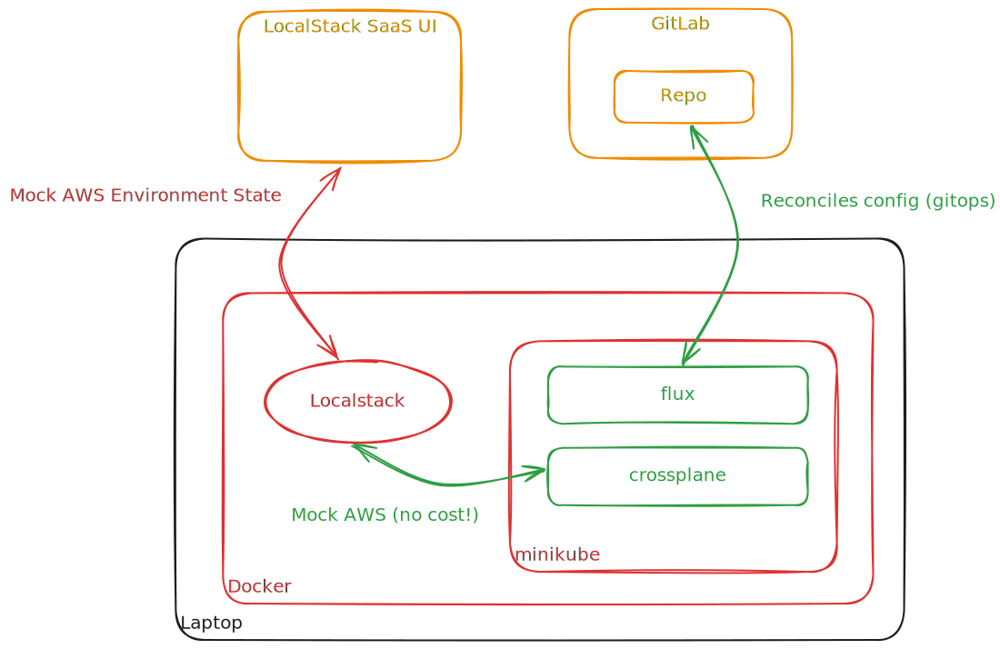

# LFCT Stack 

Localstack, Flux, Crossplane, Terraform experimentation stack for experimentation
or development of software delivery and hosting platforms.

## Prerequisites

Little bit of work needed to get this set up, but its not bad.

### 1. Create a Local Stack Account & Token

I signed up and chose a hobby license, since this is not a commercial effort,
[here](https://www.localstack.cloud/). Go to the Auth Token tab after getting
your account to copy your license token.

### 2. Install Docker

This repository assumes you have docker running on your laptop. 

### 3. Install Devbox

I'm using [Jetify Devbox](https://www.jetify.com/docs/devbox/) to quickly instantiate
and remove local laptop dev environments. This project leverages devbox to make
it simple to setup and deploy this stack.

## Getting Started

The idea is to deploy localstack, k8s w/ flux, and other components to establish
a repeatable dev stack for crossplane and terraform experimentation. The getting
started steps below should get you pretty close to the state of this repo. However, 
there are plenty of alternative approaches to setup this stack if you have your
own preferences.

### Steps

fork this repo into your own github/gitlab and then clone locally. 

`cd` into the cloned repo and run `devbox shell` to launch the local dev environment.

Run `export LOCALSTACK_AUTH_TOKEN=<insert your local stack auth token>` for your localstack Auth Token.

Run `export GITLAB_TOKEN=<gl-token>` for your gitlab personal access token

Change the 192.x.x.x ip address in `./flux/components/crossplane-providers/provider_aws.yaml` to your laptop ip address or to
a reachable ip address running localstack.

Run `task init`

:warning: :warning: :warning: everything _should_ come up automatically. However, 
I do not yet have the order of operations for the provider-family and individual providers
worked out perfectly. You may need to comment out provider_aws.yaml in the crossplane-providers
kustomize.yaml. :warning: :warning: :warning:

## Tear Down

Run `task down` to delete localstack and minikube

## References

- reference this repository's `devbox.json` to see packages used.
- reference this repository's `taskfile.yaml` and `scripts/` files to see how everything is deployed.
- project based on this [medium article](https://medium.com/@verajm/crossplane-argo-cd-and-localstack-for-local-testing-17c34109411f)
- another [article](https://medium.com/@ellinj/crossplane-and-developer-self-service-2b665a14b786) about
crossplane and developer self service.
